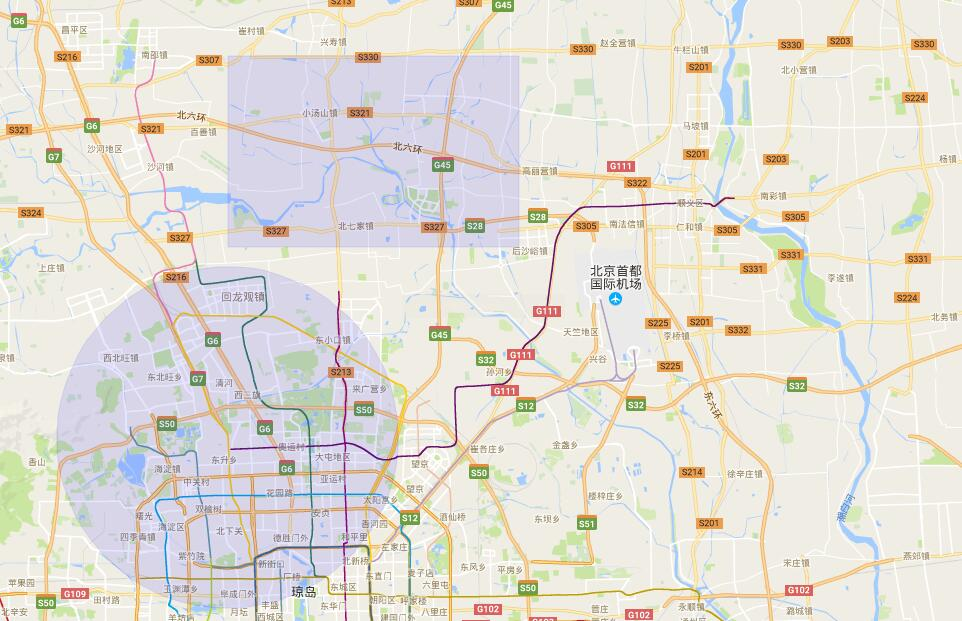

# 【一】Google_Map_moniter 谷歌地图--后台聚合（区监控）
## 1.运行
```
* $ git pull
* $ gulp;
* 替换自己的key值。V3版本。
```


## 2.业务流程

* 进入页面是区的静态数据进行渲染。此项目是区（进行一层数据聚合），google控件加载；
* 点击每个区下面进行区下面数据的实时监控。数据为实时刷新，第一次进行最优显示。
* 点击被监控的点，进入追踪模式，被追踪的点上方有该点的信息板面，可以拓展更多信息。追踪时，地图最优显示，被追踪的点居于屏幕正中，移动过的地方有追踪的线。
* 点击退出追踪，进入当前的监控的点的地图。数据为实时刷新，第一次进行最优显示。
* 退出监控，退出到区的静态数据页面。（可进行区动态数据监控。但其实没有必要。）

### 2.1 控件栏渲染
* 首先进入页面是，Google原生控件栏渲染，个人感觉比百度的控件栏好多了。所以没有进行控件重新替换。



### 2.2 区静态数据渲染
* 项目的选择和模式的选择都会走同一个函数，以得到不同的数据。


```
            for (var i = 0; i < data.all.length; i++) {
              marker_obj = me.m_draw_p(data.all[i]);
              me.p_arr.push(marker_obj);
              marker_arr.push(marker_obj.marker);
            }
```
可以看到有两个地方在收集数据。me.p_arr用于清除数据，marker_arr用于展示数据最优显示。

打marker的方式和百度的不一样，给marker设置label也不一样。这里的不一样造成需要返回marker和infoWindow两个作为属性的对象。


### 2.3 marker设置label

* google自带的label其实挺好用。但是信息显示框样式不好修改，而且右侧有关闭按钮。


* 这里采用了一个包，自定义的信息版。可以随意设置关闭按钮，透明图，相对marker位置。[源码和案例]();

### 2.4 点击区，进入区下面数据的实时监控

* 记录点击过的区数据，方便退出追踪时，进入该点击区的下面的监控页面。


* google的自定义控件比百度简单很多。[源码]()

```
          me.back_to_qu = document.createElement('div');
          new NewControl({
            p_dom: me.back_to_qu,
            map: me.map,
            offset: ['10px', 0, 0, '10px'],
            btns: ['退出监控tuij']
          }).init();
```

* 打自定义marker也比较简单：

```
          var marker = new me.Gmap.Marker({
            position: {
              lat: data.position.lat,
              lng: data.position.lng
            },
            map: me.map,
            title: '设备号：' + data.name,
            icon: '../../../images/car_online.png'
          });
```

* 实时渲染时的清除数据（相比百度比较笨重）（和点击区，进入区监控数据之前，对全部区数据进行清除一样）：

```
            // 清除数据
            if (me.qu_xm_arr.length != 0) {
              for (var i = 0; i < me.qu_xm_arr.length; i++) {
                me.qu_xm_arr[i].setMap(null);
              };
            }
```

区数据的清除：marker要清除，label要关闭的。

```
          // 清除数据，容器重置
          for (var i = 0; i < arr.length; i++) {
            // 清除点
            arr[i].marker.setMap(null);
            // 清除信息框
            arr[i].infowindow.close();
          };
```

* 最优显示数据（相比百度挺笨重），非官方解释：用到LatLngBounds这个类，官方API说明为：LatLngBounds 实例代表通过地理坐标表示的矩形，包含与 180度子午线相交的矩形。该类通过extend((point:LatLng)添加位置信息，最后通过map.fitBounds(bounds:LatLngBounds)来让地图适应该bounds下面的点集，从而达到展示标注在最佳视野的效果。

```
        // 设置最优视角
        m_setVeiwPort: function(arr) {
          /* body... */
          var me = this;
          var bounds = new me.Gmap.LatLngBounds();
          //读取标注点的位置坐标，加入LatLngBounds  
          for (var i = 0; i < arr.length; i++) {
            bounds.extend(arr[i].getPosition());
          }
          //调整map，使其适应LatLngBounds,实现展示最佳视野的功能
          me.map.fitBounds(bounds);
        },
```

### 2.5 点击被监控的点，进入追踪模式
* 追踪模式：


* 点击一个被监控的点，进入追踪，去除【退出监控】控件：
```
<!-- 创建 -->
me.back_to_qu_xm = document.createElement('div');
<!-- 删除 -->
me.map.controls[google.maps.ControlPosition.LEFT_TOP].clear(me.back_to_qu_xm);
```

* 先打点记录marker：
```
<!-- 收集点me.zz_p，me.zz_p_label 为空时，进行收集和打点 -->
          if (me.zz_p == null) {
            // 根据ID请求到数据
            var marker = new me.Gmap.Marker({
              position: {
                lat: data[0].position.lat,
                lng: data[0].position.lng
              },
              map: me.map,
              icon: '../../../images/car_online.png',
              anchorPoint: new google.maps.Point({ x: 50, y: 50 })
            });
            var str = '<div class="markLabel">' +
              '<span class="labelName" id="devName">设备名称：' + data[0].name +
              '<br />' +
              '</span>' +
              '<div class="labelArrow"></div>' +
              '</div>';
            var infowindow = me.m_p_label(str);
            infowindow.open(me.map, marker);
            // 收集marker
            me.zz_p = marker;
            me.zz_p_label = infowindow;

            view_arr.push(marker);
          }
```

* 移动marker，划线，收集所有的线（便于清除）：

```
          else {
            var newPoint = new google.maps.LatLng(data[0].position.lat, data[0].position.lng);
            var oldPoint = me.zz_p.getPosition();
            // 收集所有的折线
            me.zz_p_line.push(me.qu_xm_p_line([oldPoint, newPoint]));
            // 移动到新的点上
            me.zz_p.setPosition(newPoint);
            view_arr.push(me.zz_p);
          }
          <!-- 划线 -->
          qu_xm_p_line: function(arr) {
            // body... 
            var me = this;
            var flightPlanCoordinates = arr;
            var flightPath = new me.Gmap.Polyline({
              path: flightPlanCoordinates,
              geodesic: true,
              strokeColor: '#21536d',
              strokeOpacity: 0.8,
              strokeWeight: 4
            });
            flightPath.setMap(me.map);
            return flightPath;
          },
```

## 3.思路及注意

* 本人是先进行百度地图的各种，然后是由于业务要求进行google这个高大上的地图，感觉没有百度用的顺手
* 以 HTML5 形式声明您的应用，注意请求的src.以通过请求 http://maps.googleapis.com/（对于中国用户，则是 http://maps.google.cn）通过 HTTP 加载 Google Maps JavaScript API。

## 4.MIT
* 后期补充mongoDB数据库进行数据请求。 
* 作为框架修改可以直接拿来就用。
